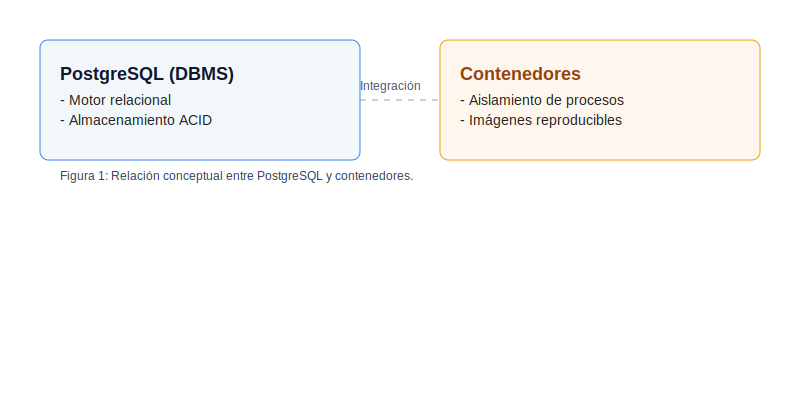
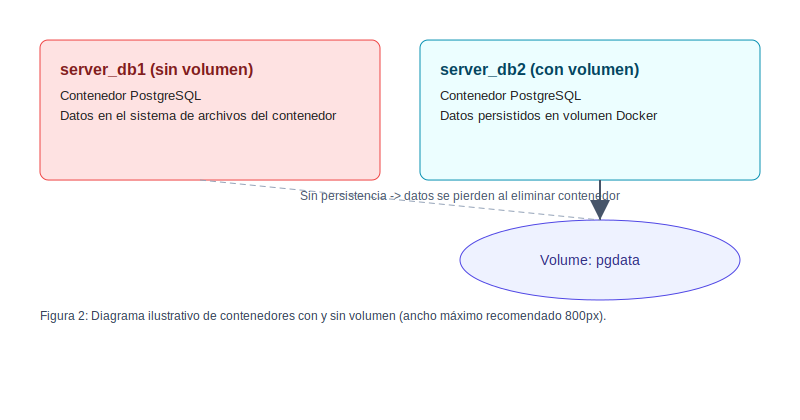

# Práctica 3 — Crear volúmenes para persistir base de datos (PostgreSQL)

## 1. Título

Crear volúmenes para persistir base de datos con PostgreSQL en contenedores Docker

## 2. Tiempo de duración

45 minutos

## 3. Fundamentos

En esta práctica se exploran dos comportamientos distintos del almacenamiento de datos cuando se ejecuta PostgreSQL dentro de contenedores Docker: (1) sin volumen Docker (datos dentro del contenedor) y (2) con volumen Docker (datos persistidos fuera del ciclo de vida del contenedor). PostgreSQL es un sistema de gestión de bases de datos relacional (RDBMS) que garantiza propiedades ACID (Atomicidad, Consistencia, Aislamiento, Durabilidad) para las transacciones. Cuando PostgreSQL se ejecuta en un contenedor, los ficheros del cluster de la base de datos (por ejemplo los datos dentro de `/var/lib/postgresql/data` en la imagen oficial) se almacenan por defecto en el sistema de archivos del contenedor. Si el contenedor se elimina, ese sistema de archivos se elimina también y con él los datos.

Usar volúmenes de Docker evita esa pérdida: un volumen es un área de almacenamiento gestionada por Docker que persiste en el host y puede montarse en contenedores. Al reutilizar el mismo volumen en un nuevo contenedor, el motor de base de datos encontrará los mismos ficheros y seguirá funcionando con los datos existentes.

Ventajas de usar volúmenes:
- Persistencia fuera del ciclo de vida del contenedor.
- Separación de datos y lógica (imagen/contendor).
- Facilita backups y restauraciones (p.ej. con `pg_dump` y `pg_restore` o copiando los datos del volumen).

Limitaciones y consideraciones:
- Compatibilidad de versiones: montar datos de una versión de PostgreSQL en otra versión mayormente incompatible puede causar fallos; se deben seguir procesos de migración.
- Rendimiento: en algunos entornos, el rendimiento de I/O puede variar según el driver de volúmenes y la configuración del host.

La figura siguiente ilustra conceptualmente la relación entre el motor PostgreSQL y los contenedores.



## 4. Conocimientos previos

Para realizar esta práctica el estudiante necesita tener claros los siguientes temas:

- Conceptos básicos de Docker (imagen, contenedor, volumen, puerto, variable de entorno).
- Uso de la línea de comandos (bash) para ejecutar comandos Docker.
- Conceptos básicos de bases de datos relacionales (crear base de datos, tablas, INSERT, SELECT).
- Manejo de un administrador de bases de datos (p.ej. DataGrip, TablePlus, pgAdmin) o uso de `psql`.
- Conceptos de redes locales y mapeo de puertos en Docker.

Ejemplos concretos de comandos y acciones que se esperan conocer: `docker run`, `docker rm`, `docker ps`, `docker volume create`, `docker volume ls`, y `psql` o conexión desde un cliente GUI.

## 5. Objetivos a alcanzar

- Crear y ejecutar contenedores PostgreSQL en Docker.
- Comprender la diferencia entre datos almacenados en el contenedor y datos almacenados en un volumen Docker.
- Insertar y consultar datos en PostgreSQL y observar qué ocurre al eliminar y recrear contenedores.
- Usar volúmenes Docker para garantizar la persistencia de datos.

## 6. Equipo necesario

- Computador con Windows, Linux o macOS.
- Docker Engine instalado (versión recomendada: Docker 20.x o superior).
- Cliente de administración de base de datos (DataGrip, TablePlus, pgAdmin o `psql`).
- Conexión a internet para descargar imágenes Docker (opcional si ya están descargadas).

## 7. Material de apoyo

- Documentación oficial de Docker: https://docs.docker.com/
- Documentación oficial de PostgreSQL: https://www.postgresql.org/docs/
- Cheat sheet de comandos Linux básicos.

## 8. Procedimiento

Parte 1: Base de datos sin volumen

1. Crear un contenedor PostgreSQL llamado `server_db1` (ejemplo):

```bash
docker run -d --name server_db1 -e POSTGRES_PASSWORD=mi_contraseña -p 5432:5432 postgres:15
```

2. Conectar desde DataGrip / TablePlus / pgAdmin o con `psql` (host=localhost, puerto=5432, user=postgres, password=mi_contraseña).

3. Crear la base de datos `test`:

```sql
CREATE DATABASE test;
\c test
CREATE TABLE customer (
	id SERIAL PRIMARY KEY,
	fullname TEXT NOT NULL,
	status TEXT
);
INSERT INTO customer (fullname, status) VALUES ('Juan Pérez','active');
SELECT * FROM customer;
```

4. Detener y eliminar el contenedor `server_db1`:

```bash
docker stop server_db1
docker rm server_db1
```

5. Volver a crear el contenedor con el mismo nombre (sin volumen):

```bash
docker run -d --name server_db1 -e POSTGRES_PASSWORD=mi_contraseña -p 5432:5432 postgres:15
```

6. Conectarse de nuevo y verificar que la base de datos `test` ya no existe (los datos no se conservaron).


Parte 2: Base de datos con volumen

1. Crear un volumen Docker llamado `pgdata`:

```bash
docker volume create pgdata
```

2. Crear un contenedor PostgreSQL llamado `server_db2` montando el volumen:

```bash
docker run -d --name server_db2 -e POSTGRES_PASSWORD=mi_contraseña -p 5433:5432 -v pgdata:/var/lib/postgresql/data postgres:15
```

> Nota: aquí mapeamos el puerto 5432 interno del contenedor al 5433 del host para poder ejecutar ambos contenedores (si los hubiera) en paralelo.

3. Conectar desde el administrador de base de datos (host=localhost, puerto=5433) y crear la base de datos `test`, la tabla `customer` e insertar un registro (mismos comandos SQL que en la Parte 1).

4. Detener y eliminar el contenedor `server_db2`:

```bash
docker stop server_db2
docker rm server_db2
```

5. Volver a crear el contenedor reutilizando el volumen `pgdata`:

```bash
docker run -d --name server_db2 -e POSTGRES_PASSWORD=mi_contraseña -p 5433:5432 -v pgdata:/var/lib/postgresql/data postgres:15
```

6. Conectarse de nuevo y verificar que la base de datos `test` y los registros persisten (los datos se conservaron gracias al volumen).

Figura 1-1. Diagrama conceptual de fundamentos


Figura 1-2. Diagrama de contenedores y volumenes



> Las figuras anteriores son SVGs con ancho máximo recomendado 800px.

## 9. Resultados esperados

- Parte 1 (sin volumen): después de eliminar `server_db1`, la base de datos `test` y sus registros NO deben existir al recrear el contenedor con el mismo nombre. Esto demuestra que los datos que se almacenan en el sistema de archivos del contenedor se pierden al eliminarlo.

- Parte 2 (con volumen): después de eliminar y recrear `server_db2` montando el mismo volumen `pgdata`, la base de datos `test` y sus registros DEBEN persistir. Esto demuestra que los volúmenes Docker permiten persistencia de datos fuera del ciclo de vida del contenedor.

Capturas de pantalla recomendadas (añadirlas en esta sección):

1. Consola mostrando `docker ps` con `server_db1` y/o `server_db2` corriendo.
2. Cliente DB mostrando la tabla `customer` y su contenido.
3. Salida de `docker volume ls` mostrando `pgdata`.

## 10. Bibliografía

- Docker, Inc. (s.f.). Docker Documentation. https://docs.docker.com/
- PostgreSQL Global Development Group. (s.f.). PostgreSQL Documentation. https://www.postgresql.org/docs/
- Negrete, A. (2021). Fundamentos de contenedores y persistencia.
